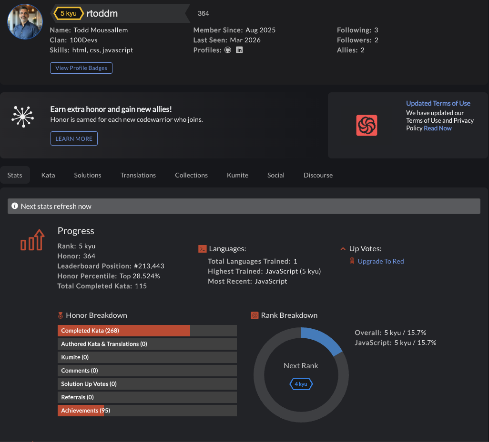

# Codewars Practice Repository



## Overview

This repository contains my ongoing Codewars practice solutions.

I use this repo to:

- Strengthen core JavaScript fundamentals
- Improve problem-solving speed
- Reinforce data structure and algorithm patterns
- Build consistency through daily practice

---

## Repository Structure

Problems are organized by category and difficulty:

```
arrays/
  ├── 8kyu/
  ├── 7kyu/
  ├── 6kyu/

linked-lists/
  ├── 8kyu/
  ├── 7kyu/

strings/
  ├── 8kyu/
  ├── 7kyu/
```

Each solution includes:

- Problem name
- Link to the original Codewars challenge
- My JavaScript solution

---

## Goals

- Push solutions consistently
- Progress from 8kyu → 6kyu → 5kyu etc...
- Focus on understanding patterns over memorizing answers
- Rewrite tricky problems from memory to reinforce retention

---

## Why This Repository Exists

Becoming a strong developer requires deliberate practice.

This repository represents:

- Consistency
- Incremental improvement
- Commitment to mastering fundamentals

---

## Tech Stack

- JavaScript (ES6+)

---

## Current Focus

- Arrays
- Strings
- Conditionals
- LinkedLists
- Loop control
- Logical operators
- Fundamental data manipulation

---

_“Reps build reflex.”_
